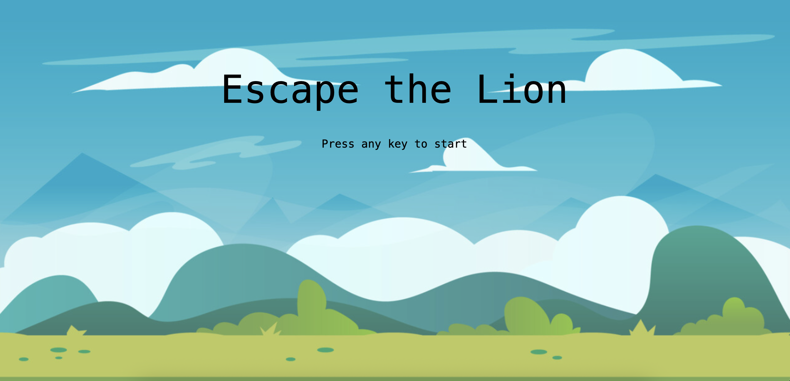

# 🦁 Escape the Lion Game

## Introduction

**Escape the Lion** is a thrilling side-scrolling running game where you must help a poacher escape a fast-approaching lion and reach the jeep to survive. 

During the chase:
- 🍖 Eat food to gain **temporary speed boosts**
- 🌿 Avoid bushes — hitting them causes the **lion to gain speed**

Can you make it to the jeep before getting caught?

[**🎮 Play the Demo**](https://cs-jonaas.github.io/escapethelion/)

---

## 🕹️ Gameplay

### Start Screen  
When the game loads, a start screen appears with the game title.  
Press **any key** to begin.

---

### In-Game Action  
Jump over bushes and leap to grab food. Stay ahead of the lion!

  

---

### Winning the Game  
Reach the jeep before the lion catches you!

  

---

### Losing the Game  
If the lion catches up, the game ends.

  

---

## ⚠️ Challenging Features

A key challenge in building this game was implementing **collision detection** between the player and multiple objects — each with a unique outcome:

(escapethelion/images/cc-function.png)
(escapethelion/images/cic-function.png)

---

## ⚙️ Future Implementations

1. **Character Animation**
   - Add running animation by alternating images of the lion and player.

2. **Jeep Escape Animation**
   - Replace win screen with a sequence where the player enters the jeep and drives away.

3. **Enhanced Difficulty**
   - Add more platforms and obstacles that require strategic jumping.

---

## 👏 Credits

__Images__
Background picture by Gabriel gabas at Artstation.com
Player and Lion Image by ChatGPT
Food and Bush on Dreamstime.com 

